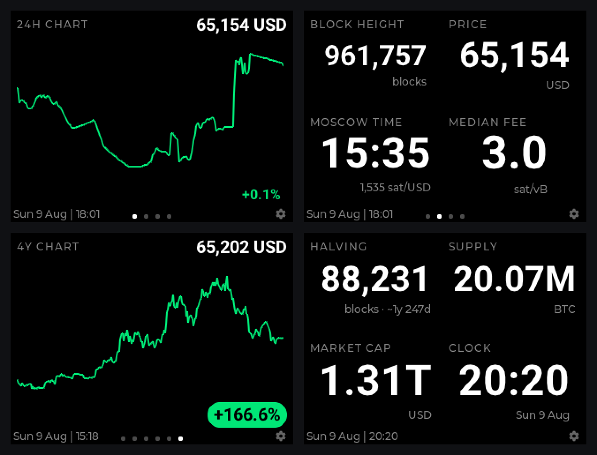

# BlockTV — the Bitcoin dashboard for MicroPythonOS

**Your own always-on Bitcoin display: block height, price, fees, charts,
halving countdown and incoming zaps — on a device that sits on your desk,
not in your pocket.**

BlockTV is the first app of its kind for
[MicroPythonOS](https://micropythonos.com): a fully customisable,
open-source Bitcoin dashboard built for small always-on screens. Compose
your own pages from sixteen data fields, swipe between them, and let the
numbers roll in odometer-style — on hardware you can hold in one hand.

From the makers of ZapTV, at [ZapTV.org](https://www.ZapTV.org).

## Why it's different

**It never lies to you.** Every point on every chart is a real market
sample — there is no smoothing, no fabricated curve, no invented data.
If a data source falls behind, its field says so: titles shade orange at
ten minutes late and red at a day, judged against what each source
actually promises. A chart that missed its refresh wears the warning
colour instead of a confident green. When the price feed goes down,
BlockTV leaves the gap and back-fills it later with what the price
actually did — it never draws an outage as a flat line pretending the
market went quiet.

**It respects your bandwidth.** All five price charts share one streaming
fetch, thinned on the fly so memory stays flat on a microcontroller. Each
range re-reads on a cadence matched to what a re-read can actually teach
it — 30 minutes for the day chart, monthly for the four-year — and
between re-reads every chart is kept current for free from the spot price
the app already polls. Resolution is sized to the panel itself: one
plotted point per pixel column, and no more.

**It's yours to arrange.** Screens are built by you, from you-sized
pieces: one huge number filling the display, or up to eight tiles in a
grid, on as many pages as you like.

## Features

### The data
- **Block height**, live from mempool.space (or your own instance)
- **Spot price** in USD, EUR, GBP, CAD, CHF, AUD or JPY
- **Moscow time** — sats per fiat unit, clock-style
- **Halving countdown** — blocks and estimated time remaining
- **Fees, three ways** — next-block median, high priority, low priority
- **Circulating supply** and **market cap**, derived on-device
- **Price charts** over 24 h, 7 d, 30 d, 1 y — and **4 years: one full
  halving cycle**
- **Clock and date**, plus an optional corner clock that stays put while
  pages turn

### The Bitcoin-native extras
- **Nostr zaps** — set your npub and the latest zap to reach you shows up
  on screen; a fullscreen zap splash flashes the amount and comment the
  moment one lands. Watch-only: no private key is ever asked for.
- **Nostr Wallet Connect** — show a wallet balance over NIP-47; incoming
  payments trigger the zap splash even without an npub.
- **24-hour chart at 5-minute resolution** — the public feed is only
  hourly, so BlockTV quietly records the price itself, twelve times finer,
  at zero extra network cost.
- **Trend badges** — each chart carries its move over the range, bold and
  colour-coded; a move big enough to matter for its window (2% on the
  day, 40% on the year, 100% on the cycle) earns a filled pill you can
  read across the room.

### Made to be yours
- **Custom screens** — 1–8 fields per page, unlimited pages, laid out
  automatically; values scale to fill their tile
- **Drag to reorder** — press a field and slide it; fields are grouped by
  category (Price, Time, Chain, Fees, Wallet) in the picker
- **Your colours** — text and background chosen independently: white,
  black, Bitcoin orange, Nostr purple, any combination
- **Attention flashes** — optionally flash the screen on a new block, or
  on any value change
- **Works without a touchscreen** — every control is reachable by
  joystick or buttons on keypad boards, and a physical button steps
  through pages

### Built like an appliance
- **Instant restarts** — last-known values persist and show immediately
  with honest stale colouring, never blank placeholders
- **Currency hopping without loss** — switching currency parks the old
  recording and brings it back when you return
- **Privacy option** — point it at your own self-hosted mempool instance
  and no third party sees your polling
- **Open source, MIT-licensed stack** — runs on cheap ESP32-S3 hardware
  with a 320×240 display, touch or not

## Get it

BlockTV is available for MicroPythonOS devices from the
[MicroPythonOS app store](https://apps.micropythonos.com) as
`org.zaptv.blocktv`, and from [ZapTV.org](https://www.ZapTV.org) —
alongside its sibling app, ZapTV.

*BlockTV displays public market data and watches public nostr events. It
holds no keys, moves no funds, and gives no financial advice — it just
shows you the state of Bitcoin, honestly.*
